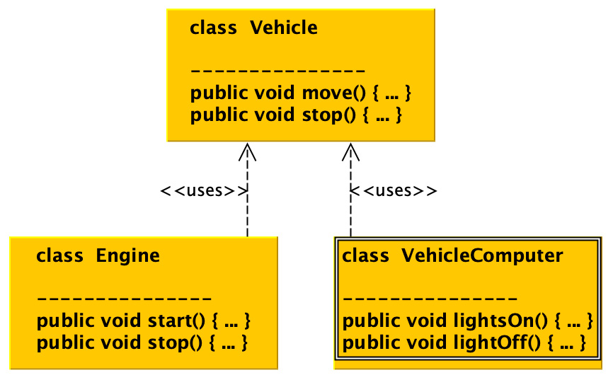
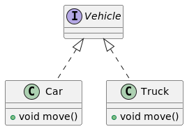
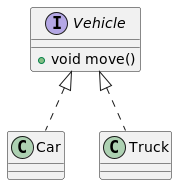
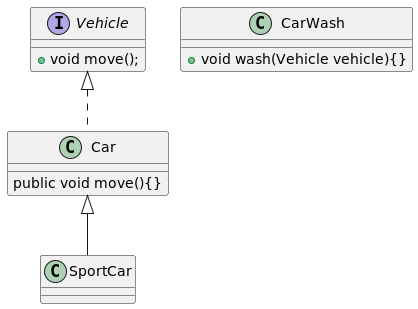
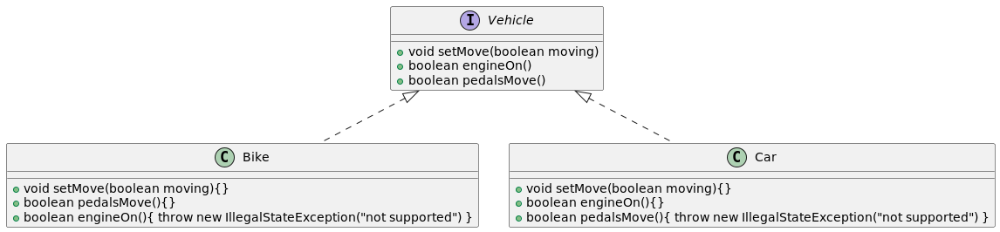
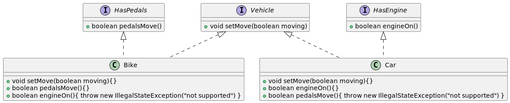
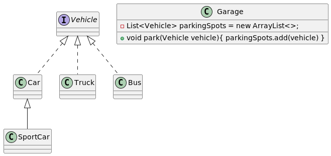

# APIE

## Abstraction
- Constant removal of specifics or specific details for the sake of **generalization** 
- Vehicle describes a common functionality that all types of vehicles can include.
- Abstracting Vehicle can have positive impact like code reduction and reusability
  - Abstract classes with abstract methods
  - Using interfaces with generic abstract method
## Polymorphism
- Many forms
- Ability to perform a particular action in many ways. Depending on the context 
- Vehicle.move can behave differently on different kinds of vehicle (many kinds of context)
### Overloading
- Static polymorphism because method is resolved during **compilation**.
  - Changing the input argument **type**
  - Changing the number of method **arguments**
### Overriding
- Dynamic polymorphism because method is resolved at **runtime**.
- Method is called through reference to the object instance of belongingness.
- Example: CommonCar move method, overriding it the car behaves different from generic Vehicle

## Inheritance
- Deriving all attributes and functions to a child class. In order to create non-perfect and unique replicas,
re-using attributes and functionality from a parent class e.g. needed to create a new Motor.     

## Encapsulation
- It only exposes the functionality it serves, all internal elements and internal functions are hidden.

# SOLID
Design Principles and Design Patterns, Robert C. Martin, Object Mentor, 2000

Goal, help software designers to make software and its structure more sustainable, reusable, and extensible.

## Single responsibility principle (SRP)
- One class should have only one reason to exist
- The engine can start and stop, but the instance of the engine class cannot control vehicle lights.


## Open-closed principle (OCP)
- class or entity should be open for extension but closed for modifications
- Example: Car and Truck classes inherit the Vehicle interface
  - Both believe that vehicle has *move* method, when 
  ```java
  List<Vehicle> vehicles = Arrays.asList(new Truck(), new Car());
  vehicles.get(0).move(); //ERROR img_1.png, FIX img_2.png
  ``` 
  
- Fix: 
- 

## Liskov substitution principle (LSP)
Given the class hierarchy of parent-child relationships, child may be replaced by its parent and viceversa.
Classes of similar type can act analogously and replace the original.
* Keynote address - data abstraction and hierarchy, Barbara Liskov, https://dl.acm.org/doi/10.1145/62139.62141, 1988.

```java
CarWash carWash = new CarWash();
carWash.wash(new Car());
carWash.wash(new SportCar());
```


## Interface segregation principle (ISP)
* No instance of a class should be forced to depend on methods that are not used  in their abstractions.
* Interface structuring guideline
* Various implementations of inherited method abstraction
```java
private static void printIsMoving(Vehicle v) {
    if (v instanceof Car) {
      System.out.println(v.engineOn());
    }
    if(v instanceof Bike) {
      System.out.println(v.pedalsMove());
    }
}
```


The functionality sprint into smaller interfaces based on their purpose.
* Two interfaces were introduced which enforce method code overload and transparency.
* the interfaces now are based on purpose
```java
private static void printIsMoving(Vehicle v) {
    // no access, no internal statet
}

private static void printIsMoving(Car c) {
  System.out.println(c.engineOn());
}

private static void printIsMoving(Bike b) {
  System.out.println(b.pedalsMove());
}
```


## Dependency injection principle (DIP)
* Guide to approach hierarchy class composition
* Low level class should not know about high level classes
* high level classes should not have information about basic classes at lower levels
* Example: garage depends on Vehicle abstraction, not concrete classes. Implementation should not depend on specific classes, but rather on their abstractions
* 

## Meaning that
* Having code in a transparent form can be beneficial for a variety of reasons
* The way to Hell is the path of continual technical debt ignorance.
* Anything that slows down or prevents the development of applications can be considered a technical debt
* Code readability is crucial for the application logic, as it is possible to verify various hypothesis.
* the idea of design pattern not only covers the readability of the code base and its purpose but also advances the ability to verify required business hypothesis
* the design pattern can be described as a set of reusable coding approaches that solve the most common problems encountered during applications development
* There is a darker side – the backlog is growing with features and technical debt. Technical debt is not necessarily a terrible thing. Technical debt can stimulate the project and can be especially useful in the concept validation phase. The problem with technical debt occurs when it is not recognized, ignored, and poorly evaluated – even worse when technical debt starts being labeled as new features.
* We can see that the entropy of the software has increased because the coherence is not maintained. The project is beginning to rot and convergence to the inevitable wasted development time increases.
* The project learning curve can help us identify a rotting project. Instead of gradual improvements towards the goal, the team experiences local successes full of technical repairs and solutions.


